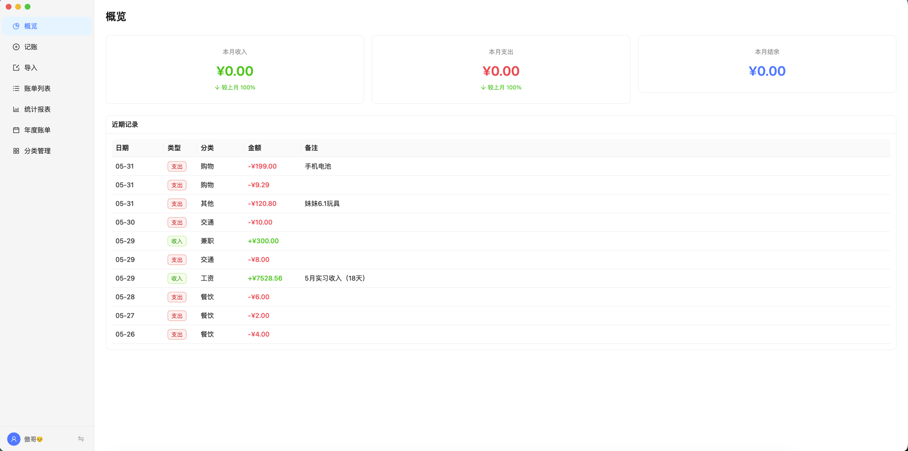
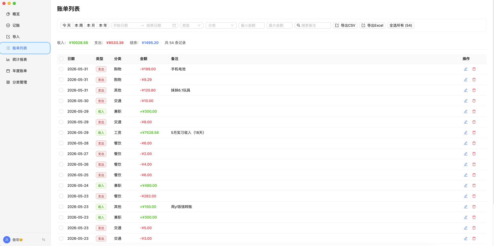
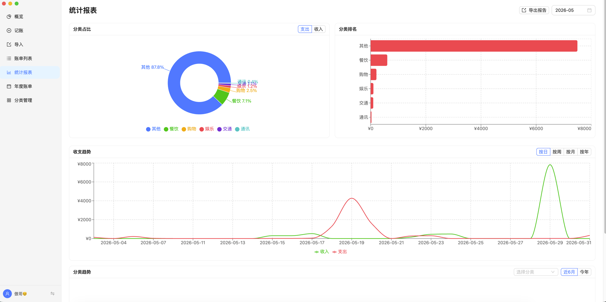
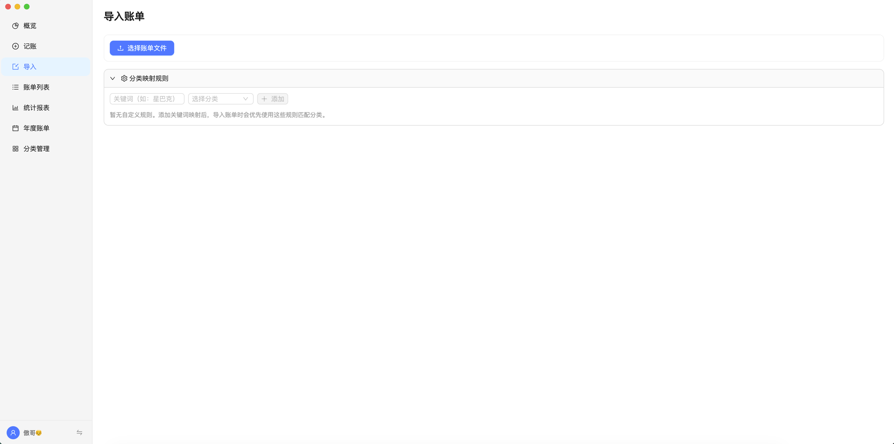
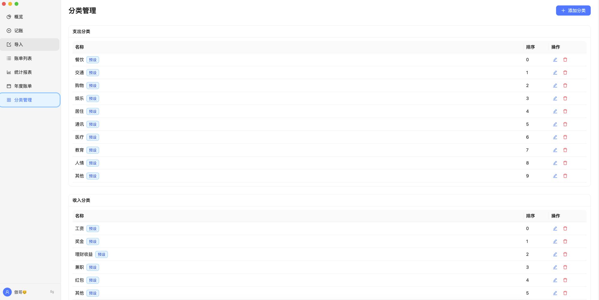

# Finance Tracker / 个人记账

一款基于 Electron 的纯本地个人记账桌面应用，数据完全存储在本地，保护你的隐私。

A local-first personal finance desktop app built with Electron. All data stays on your machine.


## Features / 功能特性

- **收支录入** — 支持多币种（CNY/USD），连续记账模式
- **快捷记账** — 全局快捷键 `Cmd+Shift+N` 唤出迷你窗口
- **账单导入** — 支持支付宝 CSV、微信 XLSX/CSV，智能分类映射
- **防重复检测** — 自动识别重复导入的账单
- **统计报表** — 饼图、柱状图、折线图，支持按日/周/月/年维度
- **年度账单** — 收支汇总、月度趋势、分类排行
- **理财管理** — 追踪本金与收益，汇总统计与趋势图
- **数据导出** — CSV、Excel、PDF 多种格式
- **中英文切换** — 界面语言一键切换，偏好持久保存
- **多用户** — 独立数据库，数据隔离
- **明暗主题** — 跟随系统自动切换
- **系统托盘** — 后台常驻，随时记账

## Tech Stack / 技术栈

- **Framework**: Electron 35 + electron-vite
- **Frontend**: React 19 + TypeScript + Ant Design 5 + Recharts
- **Database**: sql.js (SQLite via WASM, no native modules)
- **State**: Zustand

## Getting Started / 快速开始

### Prerequisites / 前置要求

- Node.js >= 18
- npm >= 9

### Install & Run / 安装运行

```bash
# Clone the repo
git clone https://github.com/liaochengjiaao-oliver/finance-tracker.git
cd finance-tracker

# Install dependencies
npm install

# Start in dev mode
npm run dev
```

### Build / 构建

```bash
# Build for macOS
npm run pack
```

构建产物位于 `release/` 目录。

## Project Structure / 项目结构

```
src/
├── main/            # Electron main process (IPC, database, import/export)
├── preload/         # Context bridge API
└── renderer/src/    # React frontend
    ├── pages/       # Page components
    └── store/       # Zustand state management
```

## Data Storage / 数据存储

所有数据存储在本地：`~/Documents/记账数据/users/<uuid>/finance.db`

使用 sql.js（基于 WASM 的 SQLite），无需安装任何原生数据库。

## Screenshots / 截图

| 概览仪表盘 | 记账 |
|:---:|:---:|
|  |  |

| 账单列表 | 统计报表 |
|:---:|:---:|
|  |  |

| 账单导入 | 分类管理 |
|:---:|:---:|
|  |  |

## Changelog / 版本记录

### v0.2.0 — 2026-06-02

- 新增理财管理模块（本金追踪、收益记录、趋势图）
- 新增中英文界面切换，语言偏好持久化
- 预设分类名跟随语言显示（餐饮 → Food, 交通 → Transit …）
- 英文翻译优化为自然口语风格
- 图表/导入页面完整国际化

### v0.1.0 — 2026-05-29

- 首次发布
- 收支录入（多币种）、快捷记账窗口
- 支付宝/微信账单导入（智能分类、防重复）
- 自定义分类映射规则
- 账单列表（筛选、编辑、批量删除、跨页全选）
- 统计报表（饼图、柱状图、折线图、分类趋势）
- 年度账单与 PDF 导出
- 多格式导出（CSV、Excel、月度 Excel/PDF 报告）
- 多用户支持、数据备份恢复
- 系统托盘、明暗主题跟随系统

## License / 许可证

[MIT](LICENSE)
